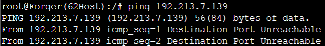

# Jarkom-Modul-5-ITA08-2022

Pengerjaan soal shift jarkom modul 5 oleh ITA08

# Anggota

| Nama                           | NRP          | 
| -------------------------------| -------------| 
| Axellino Anggoro A.              | `5027201040` | 
| Mutiara Nuraisyah Dinda R            | `5027201054` | 
| Brilianti Puspita S.  | `5027201070` |

## A. topologi


## B. Perhitungan jumlah subnet


## Pembagian IP


## Network Configuration

   - strix
      ```
      auto eth0 
      iface eth0 inet dhcp
      hwaddress ether da:d4:09:0a:bf:95

      auto eth1 #A4
      iface eth1 inet static
      address 192.213.7.145
      netmask 255.255.255.252

      auto eth2 #A5
      iface eth2 inet static
      address 192.213.7.149
      netmask 255.255.255.

      ```
   - Westalis
      ```
      auto eth0 #A4
      iface eth0 inet static
      address 192.213.7.146
      netmask 255.255.255.252

      auto eth1 #A1
      iface eth1 inet static
      address 192.213.7.129
      netmask 255.255.255.248

      auto eth2 #A3
      iface eth2 inet static
      address 192.213.0.1
      netmask 255.255.252.0

      auto eth3 #A2
      iface eth3 inet static
      address 192.213.7.1
      netmask 255.255.255.128
      ```
   - Ostania
     	```
      auto eth0 #A5
      iface eth0 inet static
      address 192.213.7.150
      netmask 255.255.255.252

      auto eth1 #A6
      iface eth1 inet static
      address  192.213.4.1
      netmask 255.255.254.0

      auto eth2 #A7
      iface eth2 inet static
      address  192.213.6.1
      netmask 255.255.255.0

      auto eth3 #A8
      iface eth3 inet static
      address  192.213.7.137
      netmask 255.255.255.248
      	```
   - Eden (DNS Server)
        ```
       auto eth0 #A1
       iface eth0 inet static
	     address 192.213.7.130
       netmask 255.255.255.248
       gateway 192.213.7.129
        ```
   - WISE (DHCP Server)
        ```
        auto eth0 #A1
        iface eth0 inet static
	      address 192.213.7.131
	      netmask 255.255.255.248
        gateway 192.213.7.129
        ```
   - Garden (WEB server)
        ```
        auto eth0 #A8
        iface eth0 inet static
        address 192.213.7.138
        netmask 255.255.255.248
        gateway 192.213.7.137
        ```
     
   - SSS (WEB server)
        ```
        auto eth0 #A8
        iface eth0 inet static
        address 192.213.7.139
        netmask 255.255.255.248
        gateway 192.213.7.137
        ```

## C. Routing    
Strix

```
route add -net 192.213.7.0 netmask 255.255.255.128 gw 192.213.7.146 #Forger
route add -net 192.213.0.0 netmask 255.255.252.0 gw 192.213.7.146 #Desmond
route add -net 192.213.7.128 netmask 255.255.255.248 gw 192.213.7.146 #Eden & WISE

route add -net 192.213.4.0 netmask 255.255.254.0 gw 192.213.7.150 #Blackbell
route add -net 192.213.6.0 netmask 255.255.255.0 gw 192.213.7.150 #Briar
route add -net 192.213.7.136 netmask 255.255.255.248 gw 192.213.7.150 #Garden & SSS
```

westalis
```
route add -net 0.0.0.0 netmask 0.0.0.0 gw 192.213.7.145
```

Ostania
```
route add -net 0.0.0.0 netmask 0.0.0.0 gw 192.213.7.149
```

## D. DHCP 
### DHCP Server
**WISE adalah DHCP Server** Pada File > /etc/default/isc-dhcp-server
	```
	echo nameserver 192.168.122.1 > /etc/resolv.conf
	apt update
	apt install isc-dhcp-server -y
	
	echo "
	INTERFACES=\"eth0\"
	" > /etc/default/isc-dhcp-server

	Pada File > /etc/dhcp/dhcpd.conf
	echo "
	ddns-update-style none;
	option domain-name \"example.org\";
	option domain-name-servers ns1.example.org, ns2.example.org;
	default-lease-time 600;
	max-lease-time 7200;
	log-facility local7;

    # Desmond (A3)
	subnet 192.213.0.0 netmask 255.255.252.0 {
	    range 192.213.0.2 192.213.3.254;
	    option routers 192.213.0.1;
	    option broadcast-address 192.213.3.255;
	    option domain-name-servers 192.213.7.130;
	    default-lease-time 360;
	    max-lease-time 7200;
	}

    # Forger (A2)
	subnet 192.213.7.0 netmask 255.255.255.128 {
	    range 192.213.7.2 192.213.7.126;
	    option routers 192.213.7.1;
	    option broadcast-address 192.213.7.127;
	    option domain-name-servers 192.213.7.130;
	    default-lease-time 720;
	    max-lease-time 7200;
	}

    # Blackbell (A6)
	subnet 192.213.4.0 netmask 255.255.254.0 {
	    range 192.213.4.2 192.213.5.254;
	    option routers 192.213.4.1;
	    option broadcast-address 192.213.5.255;
	    option domain-name-servers 192.213.7.130;
	    default-lease-time 720;
	    max-lease-time 7200;
	}

    # Briar (A7)
	subnet 192.213.6.0 netmask 255.255.255.0 {
	    range 192.213.6.2 192.213.6.254;
	    option routers 192.213.6.1;
	    option broadcast-address 192.213.6.255;
	    option domain-name-servers 192.213.7.130;
	    default-lease-time 720;
	    max-lease-time 7200;
	}
	subnet 192.213.7.128 netmask 255.255.255.248 {}
	subnet 192.213.7.144 netmask 255.255.255.252 {}
	subnet 192.213.7.148 netmask 255.255.255.252 {}
	subnet 192.213.7.136 netmask 255.255.255.248 {}
	
	" > /etc/dhcp/dhcpd.conf
	```

**jalankan DHCP Server**
```
service isc-dhcp-server restart
```

### DHCP Relay
**Ostania sebagai DHCP Relay** pada /etc/default/isc-dhcp-relay
```
echo nameserver 192.168.122.1 > /etc/resolv.conf
apt update
apt install isc-dhcp-relay -y

echo "
SERVERS=\"192.213.7.131\"
INTERFACES=\"eth2 eth3 eth1 eth0\"
OPTIONS=\"\"
" > /etc/default/isc-dhcp-relay
```

**jalankan DHCP Relay**
```
service isc-dhcp-relay restart
```
**Westalis sebagai DHCP Relay** pada /etc/default/isc-dhcp-relay
```
echo nameserver 192.168.122.1 > /etc/resolv.conf
apt update
apt install isc-dhcp-relay -y
SERVERS=\"192.213.7.131\"
INTERFACES=\"eth2 eth3 eth0 eth1\"
OPTIONS=\"\"
```

**jalankan DHCP Relay** 
```
service isc-dhcp-relay restart
```

### DNS Forwarder
Pada **Eden** sebagai DNS Server, dilakukan instalasi Bind9

```
echo nameserver 192.168.122.1 > /etc/resolv.conf
apt-get update
apt-get install bind9 -y
service bind9 start
```

**Setelah itu restart bind9 dengan**

`service bind9 restart`

## soal 1
Agar topologi yang kalian buat dapat mengakses keluar, kalian diminta untuk mengkonfigurasi Strix menggunakan iptables, tetapi Loid tidak ingin menggunakan MASQUERADE.

pada **strix** 
```
iptables -t nat -A POSTROUTING -o eth0 -j SNAT --to-source 192.168.122.191 -s 192.213.0.0/21
```

### Testing
- Desmond
  
- Eden
  
- Forger
  
- Garden
  
- Ostania
  
- SSS
  
- Strix
  
- Westalis
  
- WISE
  

## soal 2
Drop semua TCP dan UDP pada DHCP Server

Pada **Strix** dilakukan konfigurasi firewall sebagai berikut

```
iptables -A FORWARD -d 192.213.7.131 -i eth0 -p tcp -j DROP
iptables -A FORWARD -d 192.213.7.131 -i eth0 -p udp -j DROP
```

iptables di atas akan melalukan drop pada semua TCP dan UDP dengan tujuan **WISE** yang memiliki IP address `192.213.0.19`

### Testing
Ping google.com pada WISE setelah iptables


## soal 3
Membatasi DHCP dan DNS Server hanya boleh menerima maksimal 2 koneksi ICMP secara bersamaan

Limit koneksi ICMP dengan iptables pada **WISE** sebagai DHCP Server dan **Eden** sebagai DNS Server

```
iptables -A INPUT -p icmp -m connlimit --connlimit-above 2 --connlimit-mask 0 -j DROP
```

### Testing 
- SSS
  
- Forger
  
- Desmond
  

## soal 4
Akses menuju Web Server hanya diperbolehkan disaat jam kerja yaitu Senin sampai Jumat pada pukul 07.00 - 16.00

Pada **Garden** dan **SSS** sebagai Web Server, dibuat firewall sebagai berikut

```
iptables -A INPUT -m time --timestart 07:00 --timestop 16:00 --weekdays Mon,Tue,Wed,Thu,Fri -j ACCEPT
iptables -A INPUT -j REJECT
```

### Testing
- Ping **Garden** pada jam kerja


- Ping **Garden** pada hari libur


- Ping **SSS** pada jam kerja


- Ping **SSS** pada hari libur



## soal 5
Setiap request dari client yang mengakses Garden dengan port 80 akan didistribusikan secara bergantian pada SSS dan Garden secara berurutan dan request dari client yang mengakses SSS dengan port 443 akan didistribusikan secara bergantian pada Garden dan SSS secara berurutan

Pada **Ostania** dilakukan konfigurasi iptables sebagai berikut

```
# SSS
iptables -t nat -A PREROUTING -p tcp --dport 80 -m statistic --mode nth --every 2 --packet 0 -j DNAT --to-destination 192.190.7.139:80
iptables -t nat -A PREROUTING -p tcp --dport 443 -m statistic --mode nth --every 1 --packet 0 -j DNAT --to-destination 192.190.7.139

# Garden
iptables -t nat -A PREROUTING -p tcp --dport 80 -m statistic --mode nth --every 1 --packet 0 -j DNAT --to-destination 192.190.7.138
iptables -t nat -A PREROUTING -p tcp --dport 443 -m statistic --mode nth --every 2 --packet 0 -j DNAT --to-destination 192.190.7.138
```

## soal 6
Logging paket yang di-drop dengan standard syslog level

Pada **Setiap Router** dilakukan konfigurasi iptables sebagai berikut

```
iptables -N LOGGING
iptables -A INPUT -j LOGGING
iptables -A LOGGING -j LOG --log-prefix "IPTables-Dropped: " --log-level 4
iptables -A LOGGING -j DROP
```
